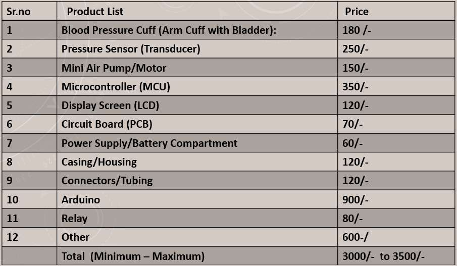

<h1>Title :- StressAway The Portable massager and Blood pressre checker</h1>
<h2>Discription</h2>

<h4>ABSTRACT</h4>

Concept of a making massager using digital blood pressure machine is initiated after understanding the concerns of old age people, during menstruation cycle of female or handicapped people who are not able to help themselves at the time when hand or leg is under sevier pain This project presents the development of a novel, multi-functional personal health device that ingeniously combines the essential features of a digital blood pressure monitor with therapeutic compression massage capabilities. Recognizing the growing need for convenient and affordable self-care solutions, the device leverages the well-established principle of intermittent pneumatic compression. By adapting the automated inflation and deflation mechanism of a standard blood pressure cuff, the prototype provides accurate Oscillo metric blood pressure measurements alongside rhythmic muscle compression for relaxation and improved circulation. The core aim was to create a handy, easy-to-use, and cost-effective unit, addressing the market gap for integrated health tools. The developed prototype successfully demonstrates dual functionality, proving the feasibility of repurposing diagnostic technology for therapeutic application. This innovation offers users a seamless way to monitor vital signs and alleviate muscle discomfort within a single, portable device, laying a strong foundation for future advancements in integrated personal healthcare.

<h4>Problem Statement</h4>

Making a portable massager designed by creatively repourposing pnumatic compression of blood pressure monitorning machine

<h4>Working Principle </h4>
1. Blood pressure machines work by measuring the pressure in the arteries by Oscillometric method  
2. Use percussive therapy, which involves rapid Press and release to massage the muscles as per the required time

<h4>Features</h4>
Portable and Multifunction device 
Light in weight and compact size 
Economical 
Painless massager 
No involvement of second person 

<h4>Hardware Components:</h4>
1.Microcontroller: Brain of the operation, controlling the entire system. 
2.Pressure Sensor: Measures pressure levels, often used in industrial or medical applications. 
3.Solenoid Valve: Electrically controlled valve, used for fluid or gas control. 
4.Battery: Power source for the system. 
5.Display Unit: Shows data, readings, or messages to the user. 
6.Arduino: A popular microcontroller platform for building interactive projects. 
7.Relay: Electrically operated switch, used to control high-power devices. 

<h4>Language Used</h4>

 C++ programming language is used.

<h4>Procedure</h4> 

<h4>Massage</h4>
1. Prepare :- sit still, relax,and elevate your legs. 
2. ⁠Belt Position :- place the belt around your paining part of body  
3. ⁠Set The Duration :- start the device,and set the duration of massage as per the requirement to get the massage  
4. ⁠Result :- after completion of task remove the belt and the pack the device properly  
                                                              

<h4>⁠Blood Pressure </h4>
1. Prepare :- sit still, relax,and elevate your legs. 
2. ⁠⁠Belt Position :- place the belt around your upper arm with the velcro facing up  
3. ⁠Cuff Inflation :- press a button to start the device. Your monitor inflates automatically  
4. ⁠Result :- cuff will slowly inflate and monitor will display blood pressure in digital format

<h4>Costing</h4>
 

 

Contact
📧 GitHub: @patilgururaj02 
📧 Gmail:patilgc2002@gmail.com
